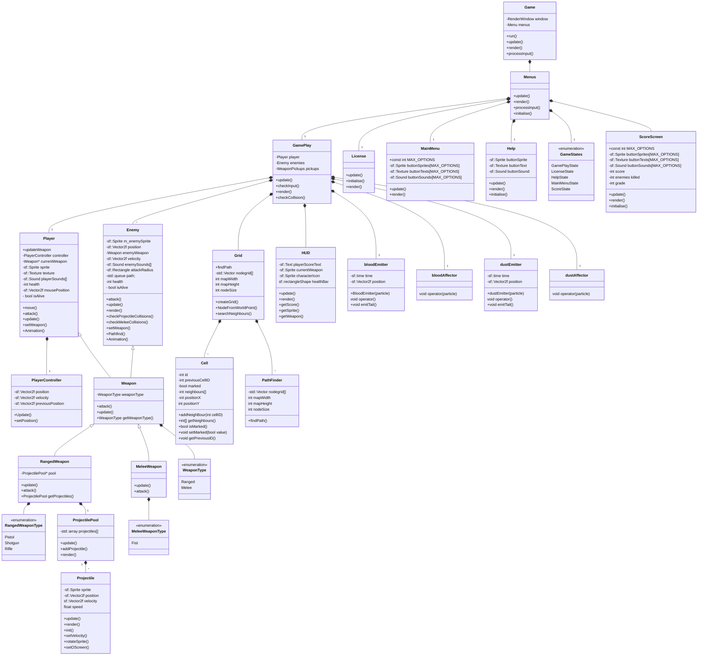

```mermaid
classDiagram
    class Game{
        +run()
        +update()
        +render()
        +processInput()

        -RenderWindow window
        -Menu menus
        
    }
    class Menus{
        +update()
        +render()
        +processInput()   
        +initialise()
    }
    class GameStates{
    <<enumeration>>
    GamePlayState
    LicenseState
    HelpState
    MainMenuState
    ScoreState
    }
    class GamePlay{
        +update()
        +checkInput()
        +render()
        +checkCollision()

        -Player player
        -Enemy enemies
        -WeaponPickups pickups
        

    }
    class MainMenu{
        +update()
        +render()
        +const int MAX_OPTIONS

        -sf::Sprite buttonSprites[MAX_OPTIONS]
        -sf::Texture buttonTexts[MAX_OPTIONS]
        -sf::Sound buttonSounds[MAX_OPTIONS]
    }
    class License{
        +update()
        +initialise()
        +render()
    }
    class Help{
        +update()
        +render()
        +initialise()

        -sf::Sprite buttonSprite
        -sf::Texture buttonText
        -sf::Sound buttonSound

    }
    class ScoreScreen{
        +update()
        +render()
        +initialise()
        +const int MAX_OPTIONS

        -sf::Sprite buttonSprites[MAX_OPTIONS]
        -sf::Texture buttonTexts[MAX_OPTIONS]
        -sf::Sound buttonSounds[MAX_OPTIONS]
        -int score
        -int enemies killed
        -int grade
    }

    class Enemy{
        +attack()
        +update()
        +render()
        +checkProjectileCollisions()
        +checkMeleeCollisions()
        +setWeapon()
        +Pathfind()
        +Animation()

        -sf::Sprite m_enemySprite
        -sf::Vector2f position
        -Weapon enemyWeapon
        -sf::Vector2f velocity
        -sf::Sound enemySounds[]
        -sf::Rectangle attackRadius
        -std::queue<int> path;
        -int health
         - bool isAlive
    }


    class Player{
        +move()
        +attack()
        +update()
        +setWeapon()
        +updateWeapon
        +Animation()


        -PlayerController controller
        -Weapon* currentWeapon
        -sf::Sprite sprite
        -sf::Texture texture
         -sf::Sound playerSounds[]
         -int health
         -sf::Vector2f mousePosition
        - bool isAlive
        
    }
    class PlayerController{
        +Update()
        +setPosition()
        -sf::Vector2f position
        -sf::Vector2f velocity
        -sf::Vector2f previousPosition
    }
    class WeaponType{
    <<enumeration>>
    Ranged
    Melee
    }
    class Weapon{
        +attack()
        +update()
        +WeaponType getWeaponType()

        -WeaponType weaponType
    }
    class RangedWeapon{
        +update()
        +attack()
        +ProjectilePool getProjectiles()

        -ProjectilePool* pool
    }
    class RangedWeaponType{
    <<enumeration>>
    Pistol
    Shotgun
    Rifle
    }
    class MeleeWeapon{
        +update()
        +attack()
    }
    class MeleeWeaponType{
    <<enumeration>>
    Fist
    }
    class PathFinder{
        +findPath()

        -std::Vector<Node> nodegrid[]
        int mapWidth
        int mapHeight
        int nodeSize
    }
    class Grid{
        +createGrid()
        +NodeFromWorldPoint()
        +searchNeighbours()
        +findPath

        -std::Vector<Node> nodegrid[]
        int mapWidth
        int mapHeight
        int nodeSize
    }
    class Cell{
        +addNeighBour(int cellID)
        +int[] getNeighbours()
        +bool isMarked()
        +void setMarked(bool value)
        +void getPreviousID()

        -int id
        -int previousCellID
        -bool marked
        -int neighbours[]
        -int positionX
        int positionY
    }
    class bloodEmitter{
        +BloodEmitter(particle)
        void operator()
        +void emitTail()

        -sf::time time
        -sf::Vector2f position
    }
    class bloodAffector{
        void operator(particle)
    }
    class dustEmitter{
        +dustEmitter(particle)
        void operator()
        +void emitTail()

        -sf::time time
        -sf::Vector2f position
    }
    class dustAffector{
        void operator(particle)
    }
    class HUD{
        +update()
        +render()
        +getScore()
        +getSprite()
        +getWeapon()

        -sf::Text playerScoreText
        -sf::Sprite currentWeapon
        -sf::Sprite characterIcon
        sf::rectangleShape healthBar
    }
    class Projectile{
        +update()
        +render()
        +init()
        +setVelocity()
        +rotateSprite()
        +setOScreen()

        -sf::Sprite sprite
        -sf::Vector2f position
        sf::Vector2f velocity
        float speed
    }
    class ProjectilePool{
        +update()
        +addProjectile()
        +render()

        -std::array<Projectiles> projectiles[]
    }

    %%Game
    Game *-- Menus

    %%Menus
    Menus *-- "1" GamePlay
    Menus *--  "1" License
    Menus *-- "1" MainMenu
    Menus *-- "1" Help
    Menus *-- "1" GameStates
    Menus *-- ScoreScreen

    %%GamePlay
    GamePlay *-- "1" Player
    GamePlay *-- "*" Enemy
    GamePlay *-- Grid
    GamePlay *-- HUD
    GamePlay *-- "1" bloodEmitter
    GamePlay *-- "1" bloodAffector
    GamePlay *-- "1" dustEmitter
    GamePlay *-- "1" dustAffector
    

    Grid *-- "*" Cell
    Grid *-- "*" PathFinder
    

    %%Player
    Player *-- "1" PlayerController
    Player <|-- Weapon


%%Enemy
    Enemy <|-- Weapon

%%Weapon
    Weapon <|--RangedWeapon
    Weapon <|-- MeleeWeapon
    Weapon *-- WeaponType
    MeleeWeapon *-- MeleeWeaponType
    RangedWeapon *-- RangedWeaponType
    RangedWeapon *-- "1" ProjectilePool
    

    ProjectilePool "1" *-- "*" Projectile
```

  