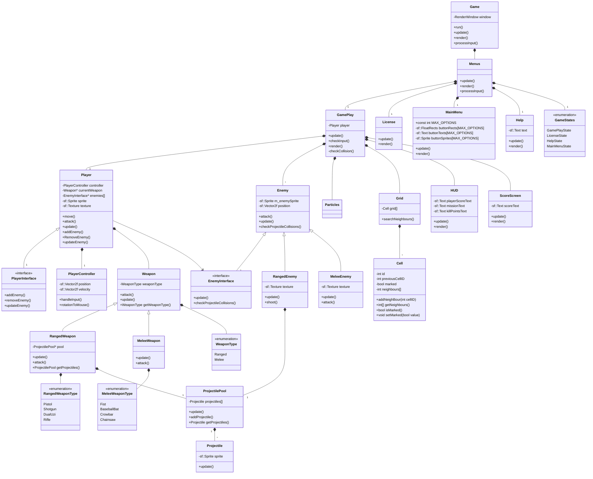

```mermaid
classDiagram
    class Game{
        +run()
        +update()
        +render()
        +processInput()

        -RenderWindow window
    }
    class Menus{
        +update()
        +render()
        +processInput()    
    }
    class GameStates{
    <<enumeration>>
    GamePlayState
    LicenseState
    HelpState
    MainMenuState
    }
    class GamePlay{
        +update()
        +checkInput()
        +render()
        -checkCollision()

        -Player player

    }
    class MainMenu{
        +update()
        +render()
        +const int MAX_OPTIONS

        -sf::FloatRects buttonRects[MAX_OPTIONS]
        -sf::Text buttonTexts[MAX_OPTIONS]
        -sf::Sprite buttonSprites[MAX_OPTIONS]
    }
    class License{
        +update()
        +render()
    }
    class Help{
        +update()
        +render()

        -sf::Text text
    }
    class ScoreScreen{
        +update()
        +render()

        -sf::Text scoreText
    }
    class EnemyInterface{
        <<interface>>
        +update()
        +checkProjectileCollisions()
    }
    class Enemy{
        +attack()
        +update()
        +checkProjectileCollisions()

        -sf::Sprite m_enemySprite
        -sf::Vector2f position
    }
    class RangedEnemy{
        +update()
        +shoot()

        -sf::Texture texture
    }
    class MeleeEnemy{
        +update()
        +attack()

        -sf::Texture texture
    }
    class PlayerInterface{
        <<interface>>
        +addEnemy()
        +removeEnemy()
        +updateEnemy()
    }
    class Player{
        +move()
        +attack()
        +update()

        +addEnemy()
        +RemoveEnemy()
        +updateEnemy()

        -PlayerController controller
        -Weapon* currentWeapon
        -EnemyInterface* enemies[]
        -sf::Sprite sprite
        -sf::Texture texture
        
    }
    class PlayerController{
        +handleInput()
        +rotationToMouse()
        -sf::Vector2f position
        -sf::Vector2f velocity
    }
    class WeaponType{
    <<enumeration>>
    Ranged
    Melee
    }
    class Weapon{
        +attack()
        +update()
        +WeaponType getWeaponType()

        -WeaponType weaponType
    }
    class RangedWeapon{
        +update()
        +attack()
        +ProjectilePool getProjectiles()

        -ProjectilePool* pool
    }
    class RangedWeaponType{
    <<enumeration>>
    Pistol
    Shotgun
    DualUzi
    Rifle
    }
    class MeleeWeapon{
        +update()
        +attack()
    }
    class MeleeWeaponType{
    <<enumeration>>
    Fist
    BaseballBat
    Crowbar
    Chainsaw
    }
    
    class Grid{
        +searchNeighbours()

        -Cell grid[]
    }
    class Cell{
        +addNeighBour(int cellID)
        +int[] getNeighbours()
        +bool isMarked()
        +void setMarked(bool value)

        -int id
        -int previousCellID
        -bool marked
        -int neighbours[]
    }
    class Particles{

    }
    class HUD{
        +update()
        +render()

        -sf::Text playerScoreText
        -sf::Text missionText
        -sf::Text killPointsText
    }
    class Projectile{
        +update()

        -sf::Sprite sprite
    }
    class ProjectilePool{
        +update()
        +addProjectile()
        +Projectile getProjectiles()

        -Projectile projectiles[]
    }

    %%Game
    Game *-- Menus

    %%Menus
    Menus *-- "1" GamePlay
    Menus *--  "1" License
    Menus *-- "1" MainMenu
    Menus *-- "1" Help
    Menus *-- "1" GameStates

    %%GamePlay
    GamePlay *-- "1" Player
    GamePlay *-- "*" Enemy
    GamePlay *-- Particles
    GamePlay *-- Grid
    GamePlay *-- HUD
    GamePlay *-- ScoreScreen

    Grid *-- "*" Cell
    

    %%Player
    Player <|-- "1" PlayerInterface
    Player *-- "1" PlayerController
    Player *-- Weapon
    Player --> EnemyInterface
    Enemy <|-- "1" EnemyInterface

%%Enemy
    Enemy <|-- RangedEnemy
    Enemy <|-- MeleeEnemy
%%Weapon
    Weapon <|--RangedWeapon
    Weapon <|-- MeleeWeapon
    Weapon *-- WeaponType
    MeleeWeapon *-- MeleeWeaponType
    RangedWeapon *-- RangedWeaponType
    RangedWeapon *-- "1" ProjectilePool
    

    RangedEnemy *-- "1" ProjectilePool

    ProjectilePool "1" *-- "*" Projectile
```
